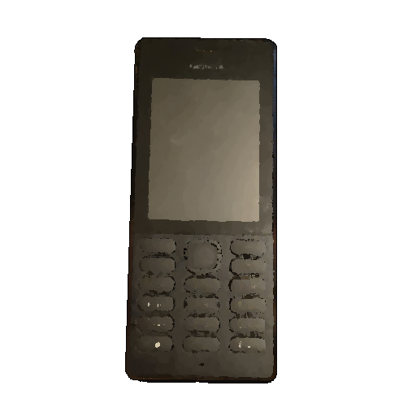
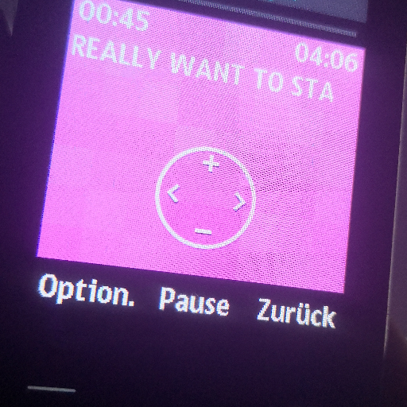
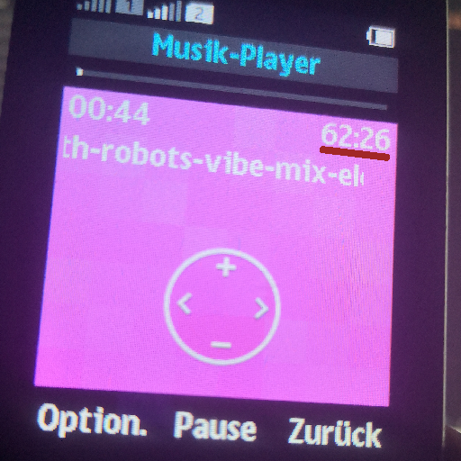

# 📱 Nokiator File-Converter


An optimized Batch script wrapper around FFmpeg designed to convert media files into formats strictly compatible with the `Nokia RM 1190` device.

## ✨ Features & Specifications

This utility ensures maximum compatibility by converting media to the **tested native formats** of the `Nokia RM 1190`:

* **Batch & Single File Modes:** Use `-f` for folder conversion or `-s` for a single file.
* **Target Output:** All converted files are saved to the dedicated `./convert` output directory.

### 🎧 Audio (MP3)
Converts audio files for resource-constrained playback and long battery life:
* **Codec:** `libmp3lame` (MP3)
* **Channels:** **Stereo**
* **Sampling Rate:** Around 44.1 kHz (works fine)
* **Audio Bitrate:** 128 kbit/s

### 🎞️ Video (MPEG4 / AVI)
Converts videos to guarantee playback on the built-in player:
* **Codec:** MPEG-4
* **Resolution:** `176x144` (`640x480` will not open)
* **Frame Rate:** `24 FPS`
* **Container:** AVI
* **Audio Bitrate:** 128 kbit/s

### 🖼️ Image (JPG/PNG)
Converts and scales images for the memory card:
* **Standard Resolution:** **640x480** (Maximum resolution of the internal camera)

### Preview on the Nokia 150


Also long audio playback is possible



## ⚠️ Prerequisites & Structures
This project is a wrapper and requires the FFmpeg binary to function. 
* Ensure that FFmpeg is accessible by the helper scripts within the ./src directory.

> [!ATTENTION]
> Paths can't contain spaces, otherwise the tool crashes

### Project Structure

The project must maintain the following file structure:

    .
    ├── nokiator.bat
    └── src
        ├── ffmpeg_audio.bat    (Audio encoding helper)
        ├── ffmpeg_video.bat    (Video encoding/scaling helper)
        ├── ffmpeg_image.bat    (Image conversion helper)
        └── show_help.bat       (Usage guide)

### Output

All converted files are saved in the subfolder ./convert, which is located in the same directory as the Batch script. The original files remain unchanged.

```
converter.bat
/convert/
    ├─ Song A.mp3
    ├─ Song B.mp3
    └─ ...
```

## 🛠️ Usage
The script is executed using three required arguments: Mode, Output Type, and the Input Path.

Call Format:
```bash
nokiator.bat [MODE] [TYPE] "PATH"
```

> [!IMPORTANT]
> Paths containing spaces MUST be enclosed in double quotes ("").

### Mode Options

|Option|Description|
|---|---|
|-h|Shows the help menu(`./src/show_help.bat`)|
|-f|Folder Mode: Converts ALL supported input files in the given `PATH`.|
|-s|Single File Mode: Converts the specific single file `PATH`.|

### Type Options

You can convert only one batch of audio at each session.
So if you need to convert multiple types like e.g. `mp3` & `ogg`, you need to start the program 2 times!

|type|arg(only one)|
|---|---|
|audio|`mp3`, `ogg`|
|video|`mp4`, `avi`, `mov`|
|image|`jpeg`, `jpg`, `png`|

### Examples

|Scenario|Command|Result|
|---|---|---|
|Folder Mode(Audio)|`nokiator.bat -f mp3 "C:\My Music"`|Searches for all .mp3 files and converts them to .mp3 (optimized audio).|
|Folder Mode (Video)|`nokiator.bat -f mp4 ".\raw_videos"`|Searches for all .avi files and converts them to .mp4 (optimized video).|
|Single File Mode (Image)|`nokiator.bat -s png "C:\Pics\Vacation.bmp"`|Converts Vacation.bmp to .png (optimized image size).|

[^1]: Copyright 2025 - Justus Decker - GPL V3 License